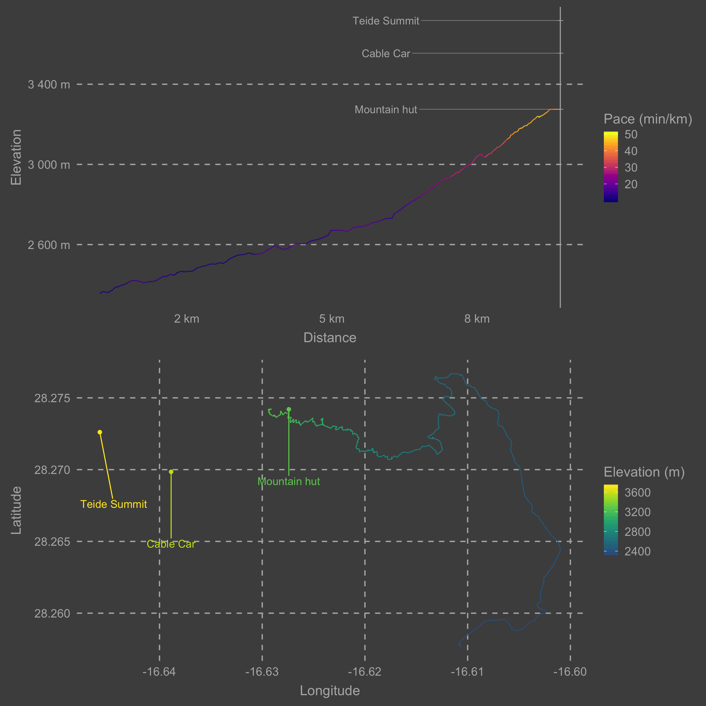

# README

The day we almost summit the Spanish tallest mountain, (Teide 3,718 m). After going back to sea level we needed to know how close we were to our original aim. Obviously, we are not experimented hikers and this was a quite hard route.

* Data obtained during the route using strava, then extracted the gpx file from the website
* Code available [here](https://github.com/davidmasp/summit_strava)

Top panel represents elevation (vertical) for the route. Colour represents the rollmean pace. Bottom panel represents the route in a 2D plane by latitude and longitude. Colour represents elevation. 3 important points are highlighted, cabin cable top (initial aim) and Teide summit.

## Steps to reproduce

1. Obtain the `.gpx` file from your strava profile
2. save it to the data folder
3. run the script
