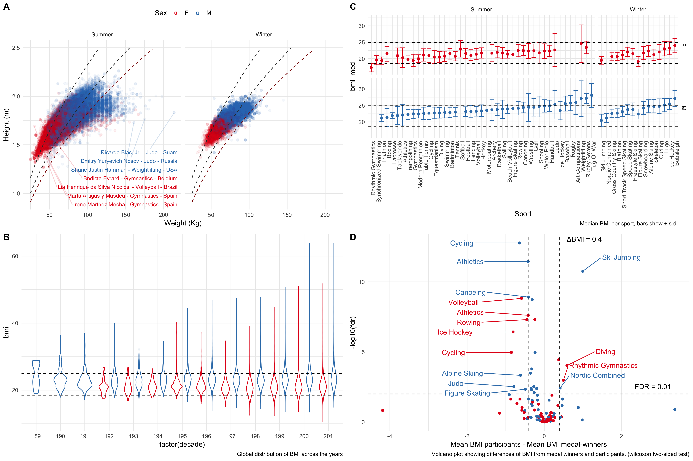

# README

## Figure



## Useful commands

* To obtain scriptable R code from the Rmd file use, 
 
```R
knitr::purl("bmi_olympic_athletes.Rmd",documentation = 2)
```

* To run the notebook run

```R
install.packages(readr::read_lines("require.txt"))
rmarkdown::render(input = "bmi_olympic_athletes.Rmd")
````

* To download raw data from kaggle run

```bash
mkdir -p data
cd data
kaggle datasets download -d heesoo37/120-years-of-olympic-history-athletes-and-results
unzip 120-years-of-olympic-history-athletes-and-results.zip 
```
