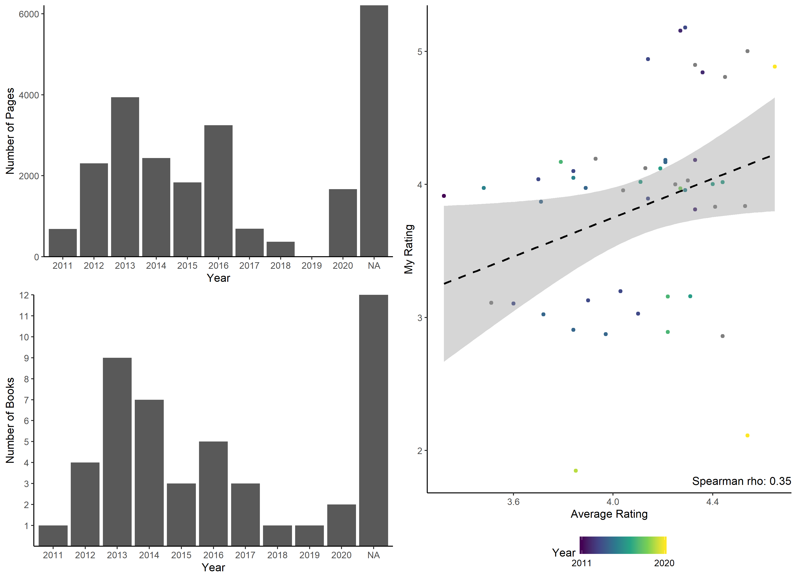

# Goodreads Viz
* author: David Mas-Ponte
* date: 2020-01-18
## Usage
In order to compile this report, run:


```r
rmd_file = knitr::spin("script.R", knit = FALSE)
knitr::knit(rmd_file,output = "README.md")
fs::file_delete(rmd_file)
```

You will need to install the following dependencies first:

* cowplot
* dplyr
* fs
* ggplot2
* glue
* knitr
* lubridate
* magrittr
* readr
* renv

## Data source
[Goodreads](https://www.goodreads.com/) is a
book logger, database and social network where you can
basically log your reading progress from current books, rate them, share
book suggestions with friends and more.
Some authors also use it to interact with their readers.

To obtain the raw data from your logged books you can use the
Import/Export tab by following this
[link](https://www.goodreads.com/review/import)

This will generate a `.csv` file which you can save in a directory named
`data`. It needs to be in the same folder as the `script.R`


```r
## script info:
# Name: goodreads Vizz
# Author: DMP
# Description: Vizzualize my read books

# imports -----------------------------------------------------------------
library(magrittr)
library(ggplot2)
library(cowplot)

# data --------------------------------------------------------------------
file = "data/goodreads_library_export.csv"
dat = readr::read_csv(file)
```

```
## Parsed with column specification:
## cols(
##   .default = col_character(),
##   `Book Id` = col_double(),
##   `My Rating` = col_double(),
##   `Average Rating` = col_double(),
##   `Number of Pages` = col_double(),
##   `Year Published` = col_double(),
##   `Original Publication Year` = col_double(),
##   `Date Read` = col_date(format = ""),
##   `Date Added` = col_date(format = ""),
##   Spoiler = col_logical(),
##   `Private Notes` = col_logical(),
##   `Read Count` = col_double(),
##   `Recommended For` = col_logical(),
##   `Recommended By` = col_logical(),
##   `Owned Copies` = col_double(),
##   `Original Purchase Date` = col_logical(),
##   `Original Purchase Location` = col_logical(),
##   Condition = col_logical(),
##   `Condition Description` = col_logical(),
##   BCID = col_logical()
## )
```

```
## See spec(...) for full column specifications.
```

```r
# script ------------------------------------------------------------------

dat$year_read = dat$`Date Read` %>% as.Date() %>% lubridate::year()

## filter
dat_toread = dat %>% dplyr::filter(dat$`Exclusive Shelf` == "to-read")

dat_read = dat %>% dplyr::filter(dat$`Exclusive Shelf` == "read")

raiting_cor = with(dat_read,cor(`My Rating`,
                                `Average Rating`,
                                method = "spearman")) %>% round(digits = 2)

p1 = dat_read %>%
  ggplot(aes(y = `My Rating`,x = `Average Rating`, color = year_read)) +
  geom_jitter(height = 0.2,width = 0) +
  geom_smooth(method = "lm",color = "black",linetype = "dashed") +
  theme_classic() +
  scale_color_viridis_c(breaks = c(min(dat_read$year_read,na.rm = T),
                                  max(dat_read$year_read,na.rm = T))) +
  annotate(x  =Inf,y = -Inf,geom = "text",
           label = glue::glue("Spearman rho: {raiting_cor}"),
           hjust = 1,
           vjust = -1) +
  theme(legend.position = "bottom") +
  labs(color = "Year")

p2 = dat_read %>% ggplot(aes(x = factor(year_read))) +
  geom_bar() +
  scale_y_continuous(breaks = 1:15, expand = c(0,0)) +
  labs(y = "Number of Books", x = "Year") +
  theme_classic()

p3 = dat_read %>% ggplot(aes(x = factor(year_read),
                             y = `Number of Pages`)) +
  geom_bar(stat = "identity") +
  scale_y_continuous(expand = c(0,0)) +
  labs(y = "Number of Pages", x = "Year") +
  theme_classic()
```

```r
plot_grid(plot_grid(p3,p2,ncol = 1),p1,ncol = 2)
```

```
## Warning: Removed 1 rows containing missing values (position_stack).
```



