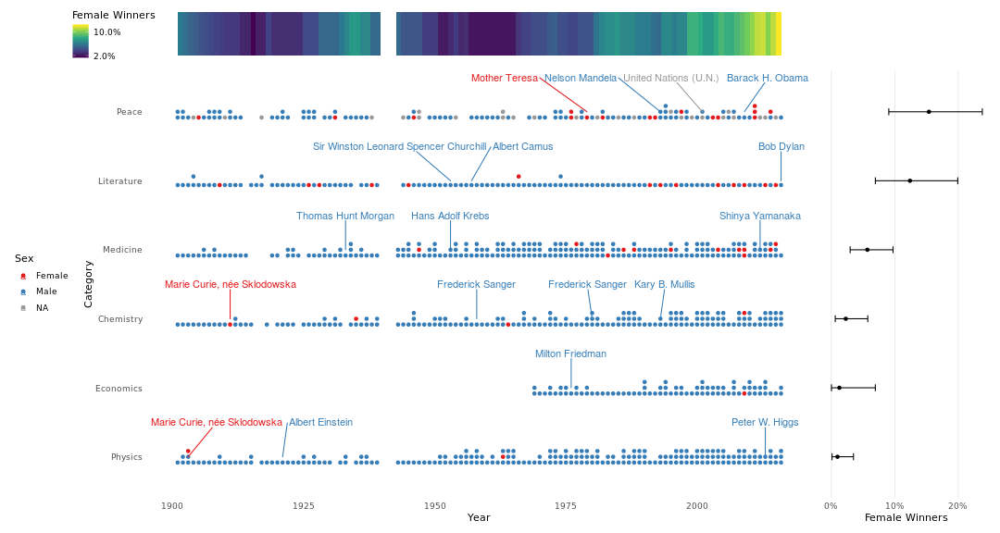

# Female Nobel Laureates Viz

* author: David Mas-Ponte [](https://twitter.com/davidmasp)
* date: 2020-01-19

## Data

Steps to download the dataset from kaggle. In order to
install the kaggle API client
see [this](https://github.com/Kaggle/kaggle-api)


```bash
kaggle datasets download -d nobelfoundation/nobel-laureates
unzip nobel-laureates.zip
```

This will automatically download your file. 


## Usage

To compile this file please run:


```r
rmd_file = knitr::spin("script.R", knit = FALSE)
knitr::knit(rmd_file,output = "README.md")
fs::file_delete(rmd_file)
```

This will render the script.R file and generate a README.md
file.

<details>
  <summary>You will need to install the following <bold>dependencies</bold> first:</summary>
  <br>

* broom
* dplyr
* forcats
* fs
* ggplot2
* ggrepel
* ggstance
* glue
* knitr
* magrittr
* patchwork
* purrr
* readr
* renv
* scales
* tidyr
* zoo

</details>


## Code

We define a vectorial binom test function. It takes data as vector and
it applies the `binom.test` to each combination of files.
This is very helpful to fit in my workflow. In this report, I use 
this function to generate the 
[confidence intervals for the binomial proportions](https://en.wikipedia.org/wiki/Binomial_proportion_confidence_interval).


```r
# funs --------------------------------------------------------------------
binom_test <-function(x,n,p,alternative,conf.level) {
  lol = list(x,n,p)
  purrr::pmap_df(lol,function(x,n,p){
    binom.test(x,n,p,alternative = alternative,conf.level = conf.level) %>%
      broom::tidy()
  }) -> test_df
  test_df
}
```

Here I import external packages that I will use. Mostly I try to use
the `pkg::fun` style but for some packages it gets really messy.


```r
# imports -----------------------------------------------------------------
library(magrittr)
library(ggplot2)
library(patchwork)
```

The data is downloaded in the chunk below from kaggle. It's quite
tidied already so there's not much need for wrangling.

In the data some of the winners have multiple entries 
due to multiple countries. One example is Shinya Yamanaka.
Because in this plot we are not intereseted in the country of origin 
at all we can discard the duplicated entries. I use the year to 
avoid removing the double winners.


```r
# data --------------------------------------------------------------------
dat = readr::read_csv("archive.csv")
```

```
## Parsed with column specification:
## cols(
##   Year = col_double(),
##   Category = col_character(),
##   Prize = col_character(),
##   Motivation = col_character(),
##   `Prize Share` = col_character(),
##   `Laureate ID` = col_double(),
##   `Laureate Type` = col_character(),
##   `Full Name` = col_character(),
##   `Birth Date` = col_date(format = ""),
##   `Birth City` = col_character(),
##   `Birth Country` = col_character(),
##   Sex = col_character(),
##   `Organization Name` = col_character(),
##   `Organization City` = col_character(),
##   `Organization Country` = col_character(),
##   `Death Date` = col_date(format = ""),
##   `Death City` = col_character(),
##   `Death Country` = col_character()
## )
```

```
## Warning: 2 parsing failures.
## row        col   expected     actual          file
## 343 Birth Date valid date 1898-00-00 'archive.csv'
## 749 Birth Date valid date 1943-00-00 'archive.csv'
```

```r
dat[dat$`Full Name` == "Shinya Yamanaka",]
```

```
## # A tibble: 2 x 18
##    Year Category Prize Motivation `Prize Share` `Laureate ID` `Laureate Type` `Full Name` `Birth Date` `Birth City` `Birth Country`
##   <dbl> <chr>    <chr> <chr>      <chr>                 <dbl> <chr>           <chr>       <date>       <chr>        <chr>          
## 1  2012 Medicine The … "\"for th… 1/2                     875 Individual      Shinya Yam… 1962-09-04   Osaka        Japan          
## 2  2012 Medicine The … "\"for th… 1/2                     875 Individual      Shinya Yam… 1962-09-04   Osaka        Japan          
## # … with 7 more variables: Sex <chr>, `Organization Name` <chr>, `Organization City` <chr>, `Organization Country` <chr>, `Death
## #   Date` <date>, `Death City` <chr>, `Death Country` <chr>
```

```r
dat %<>% dplyr::distinct(Year,`Full Name`,.keep_all=TRUE)
```

I use this section to select some parameters.


```r
# params ------------------------------------------------------------------
text_size = 8

# mask = grep("chill",dat$`Full Name`)
# dat[mask,"Full Name"]
selected = c("Marie Curie, née Sklodowska",
             "Shinya Yamanaka",
             "Frederick Sanger",
             "Milton Friedman",
             "Sir Winston Leonard Spencer Churchill",
             "Albert Camus",
             "Barack H. Obama",
             "Bob Dylan",
             "Kary B. Mullis",
             "United Nations (U.N.)",
             "Mother Teresa",
             "Albert Einstein",
             "Peter W. Higgs",
             "Nelson Mandela",
             "Hans Adolf Krebs",
             "Thomas Hunt Morgan")
```

## Percentatge through time

In this first plot I try to show clearly that the percentatge of 
Nobel female winners is increasing with time so although still
the percentatge is very low it is increasing.

Methodologically I use a partial roll mean function to smooth the
noise. Basically instead of ploting the actual value of that 
year I use the mean of the 20 years around that year. This is 
a technique used to remove years that may not represent the 
actual tendency.


```r
# plot 1 ------------------------------------------------------------------
dat %>%
  dplyr::filter(!is.na(Sex)) %>% 
  dplyr::group_by(Year,Sex) %>% 
  dplyr::summarise(n = dplyr::n()) %>% 
  tidyr::pivot_wider(names_from = Sex,
                     values_from = n,
                     values_fill = list(n = 0)) %>%
  dplyr::ungroup() %>% 
  dplyr::mutate(female_perc = (Female / (Male+Female))) %>% 
  dplyr::mutate(female_perc_rm = zoo::rollapply(female_perc,
                                                FUN = mean, 
                                                width = 20,
                                                partial = TRUE)) %>% 
  ggplot(aes(fill = female_perc_rm,x = Year, y = 1)) +
  geom_tile() + 
  scale_fill_viridis_c(breaks = c(0.02,0.1),labels = scales::percent) +
  theme_minimal() +
  labs(fill = "Female Winners") +
  theme(text = element_text(text_size),
        panel.grid = element_blank(),
        axis.text = element_blank(),
        axis.title = element_blank(),
        legend.direction = "vertical",
        legend.key.height = unit(0.1, "in"),
        legend.position = c(-.05,0.5)) -> p_percentatge
```

## Category percentatges

In this plot I wanna show that the percentatge of women differs 
substantially between categories. The categories with far less 
women are Pysics, Economics and Chemistry. To be honest I am 
rather surprised Economics has only one female winner. 
Particullarly being such a young category compared with the others. 

In order to obtain significance estimates I use the binomial test.
This is important because the numbers are in general very low
so it's good to estimate the confidence intervals.


```r
# plot perc ---------------------------------------------------------------
dat %>%
  dplyr::filter(!is.na(Sex)) %>% 
  dplyr::group_by(Sex,Category) %>% 
  dplyr::summarise(n = dplyr::n()) %>% 
  tidyr::pivot_wider(names_from = Sex,
                     values_from = n,
                     values_fill = list(n = 0)) %>%
  dplyr::ungroup() %>% 
  dplyr::mutate(female_perc = (Female / (Male+Female))) %>% 
  dplyr::mutate(Category = forcats::fct_reorder(Category,
                                      .x = female_perc))-> dat2

cat_levels = levels(dat2$Category)
  
test_df = binom_test(x = dat2$Female,n = dat2$Female + dat2$Male,p = 0.5,
                     alternative = "two.sided",conf.level = 0.95)
dat2 = cbind(dat2,test_df)

dat2 %>% 
  ggplot(aes(x = Category,
             y = female_perc,
             ymax = conf.high,
             ymin = conf.low)) +
  geom_point() + 
  geom_errorbar(width = 0.1) + 
  scale_y_continuous(labels = scales::percent,breaks = c(0,0.1,.2)) + 
  coord_flip() +
  labs(y = "Female Winners") + 
  theme_minimal() +
  theme(axis.text.y = element_blank(),
        panel.grid.minor = element_blank(),
        panel.grid.major.y = element_blank(),
        axis.title.y = element_blank(),
        axis.ticks = element_blank(),
        text = element_text(text_size))-> p_cate
```

## Timeline

Finally I wanted to show raw dat in the map as this is the type of
plots we enjoy the most. The idea is that the viewer can obtain a 
quick glance to the individual points. It also needs to show clearly
the effects shown in the summary plots. 

In this case, we can see how the red points began to arise slowly and
that some categories have way more red points. It's also seen
that the peace prize can be won by organizations like UN.

There's also other information you can extract from this plot which 
isn't the focus of this viz but is worth mentioning. For example, 
the literature price is given normally to a single author while
in Science it goes to multiple people. This somehow examplifies
how the colaboration is very important in those disciplines.
We can also see that in the beggining the norm was to only 
give the price to one researcher and that nowadays they're 
mostly awarded to teams.

Finally I also wanted to highlight some relevant winners I've
heard about. I think it's important to put some information
which the audience can relate to what they hear in the news 
so they can remember that those points are real people.

My choice was completely arbitrary, I tried to choose people
that I knew expecting that other people will know them too.


```r
# plot raw ----------------------------------------------------------------
dat$Category = forcats::fct_relevel(dat$Category,cat_levels)

dat = dat %>% dplyr::group_by(Category, Year) %>% 
  dplyr::mutate(pos = 1:dplyr::n())

pd = ggstance::position_dodgev(height = 0.25,preserve = "total")
ggplot(dat,aes(y = Category, x = Year,color = Sex)) + 
  geom_point(aes(group = pos),position = pd) +
  ggrepel::geom_text_repel(data = subset(dat,`Full Name` %in% selected),
                           aes(label = `Full Name`),nudge_y = 0.5)  +
  theme_minimal() +
  theme(legend.position = "left") +
  scale_color_brewer(palette = "Set1",na.value = "gray60") + 
  theme(panel.grid = element_blank(),
        text = element_text(text_size)) -> p_timeline

# figure ------------------------------------------------------------------
```

```r
p_percentatge + plot_spacer() + p_timeline + p_cate + 
  plot_layout(widths = c(12, 3),heights = c(0.8,7.2), ncol = 2)
```



```r
ggsave(filename = "plot.png",width = 15,height = 8,units = "in")
```

