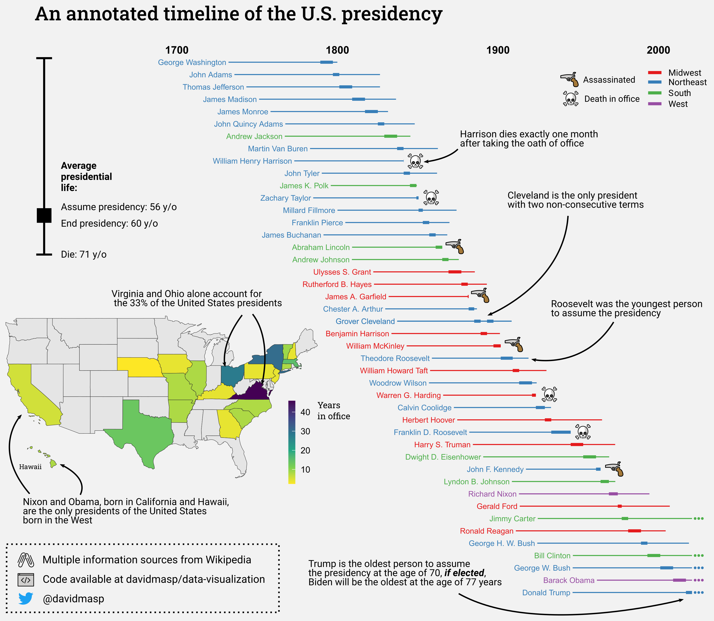

# An annotated timeline of the U.S. presidency

As a non-american I learnt a lot from plotting a timeline of US presidents.

## How did I do it?

I started this to practice wikipedia export parsing, I originally thought
this would be an easy tasks as presidents of the U.S. are probably within
the most documented thing in the internet. Although it proved more
difficult than I expected I manage to get a workable solution.

The first step is to
[export the Wikipedia files](https://en.wikipedia.org/wiki/Special:Export)
from the
[US presidential category](https://en.wikipedia.org/wiki/Category:Presidents_of_the_United_States).
Basically, this step will export a
[xml file](https://en.wikipedia.org/wiki/XML) with the
wikipedia pages of the US presidents.

After battling a bit with text search and the `xml2` package, the second
step is to parse the wikipedia data into a data frame. This become more
problematic than I thought because the standard for "terms" is a bit diffuse.
It easily gets mixed with Congress and Senate terms. As an example,
[Cleveland](https://en.wikipedia.org/wiki/Grover_Cleveland)
has to non-consecutive presidencies
(he is both the 22nd and the 24th president of the US if that makes any sense)
and it was impossible to distinguish that from a non-presidential term.
The most problematic bit though is the born place. I took a bit of a crazy
step and I decided to just capture the state where they were born using
a big regular expression. This approach yielded some errors I had to
correct manually.

With these data in a table I plotted both the timeline and the map of the
United States. For the timeline I chose to represent their whole life
from birth to death, highlighting their presidency time. I was surprised
how consistent this was compared to some EU countries
[like Spain](https://upload.wikimedia.org/wikipedia/en/timeline/b19c9fdb2b60e963e472dace8057bd26.png).

I also calculated the average assumed presidency time and death time which
I then manually plotted using
[inkscape](https://en.wikipedia.org/wiki/Inkscape).

Finally I also gathered a collection of emoji from the
[openmoji](https://openmoji.org/)
site to use in the visualization.

After all of this plotting I started the manual curation of the items in
[inkscape](https://en.wikipedia.org/wiki/Inkscape).
I basically moved around legends (and the islands of Hawaii) and
added annotation text an arrows. I also added 3 points in the
presidents which are still alive.

## What can we see in the data?

I think the most clear point I wanted to make is the Northeast-enrichment in the
data. As expected by the fact that the original colony was located there
I still find surprising the few presidents the south and the west has had.
The Ohio data was also surprising as I thought it was a smallish state.

The second least obvious thing to see is that presidents are becoming older
and older for Republicans (i.e. Trump) while younger and younger for
Democrats (Carter, Clinton and Obama). I assume
this trend will change if Biden is elected who will become the oldest
person to become president in the US at 77.

The third observation is how many presidents ended up dead in office. I find
surprising that half of them weren't assassinated but died from natural causes.
