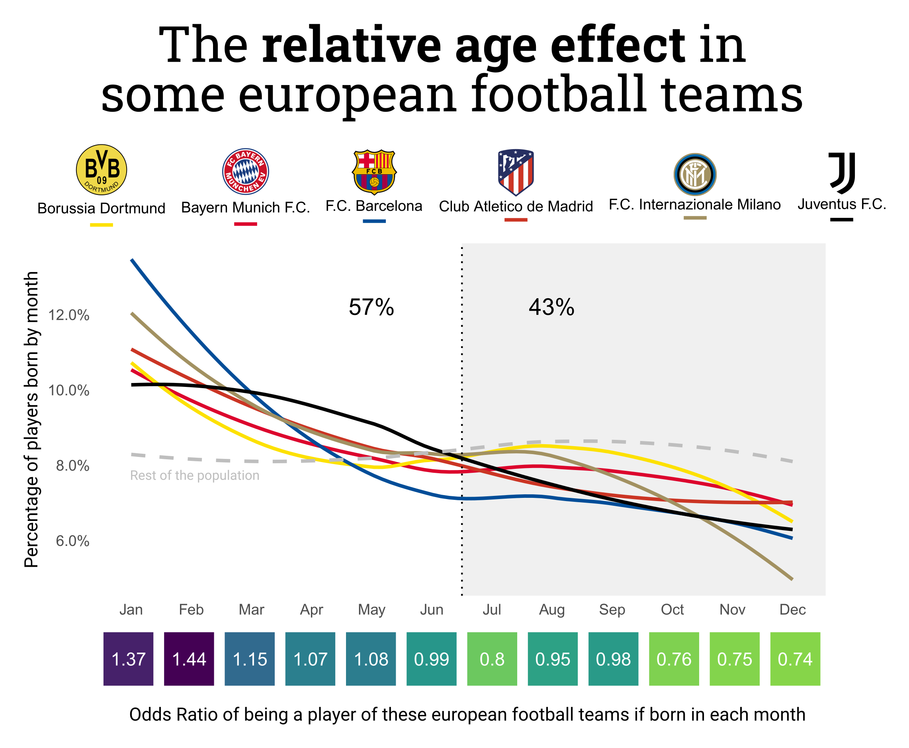

# The relative age effect in some European football teams, visualized

I exported pages from Wikipedia corresponding to each team players (for example, I used [this category]([https://en.wikipedia.org/wiki/Category:Atlético_Madrid_footballers](https://en.wikipedia.org/wiki/Category:Atl%C3%A9tico_Madrid_footballers)) for Atletico de Madrid players). I then parsed the pages in each file to extract the birth date of each player. I could extract this info for around 75-80% of player's pages. I ended up with 300 to 800 instances per team.

I extracted Spain's birth numbers per month from [here]([https://www.ine.es/jaxi/Datos.htm?path=/t20/e301/provi/l0/&file=01004.px#!tabs-tabla](https://www.ine.es/jaxi/Datos.htm?path=/t20/e301/provi/l0/&file=01004.px#!tabs-tabla)). I know European data would be more suitable but I was more familiar with Spanish data and I don't think it would have changed drastically. This percentages were used to compute the "baseline" of the population compared to the other teams.

The line represents the smoothed trend line (in particular, a loess regression) of the percentage of players in each month. The data was extremely wobbly if considered individually and because I wanted to make one line per team I preferred to use this approach. I also used a span of 1 in the ggplot function.

The [relative age effect](https://en.wikipedia.org/wiki/Relative_age_effect) is a concept in economics which describes that in athletic competitions, the people born just after a age cut-off are preferred as they are more developed in the early stages of the needed skills.

## Usage

Download a Wikipedia category pages from [here]() and then add the path of
the exported `.xml` file into the `params.json`. After that, run the script.

## Notes

The colors of the teams were obtained from [here](https://teamcolorcodes.com/)

