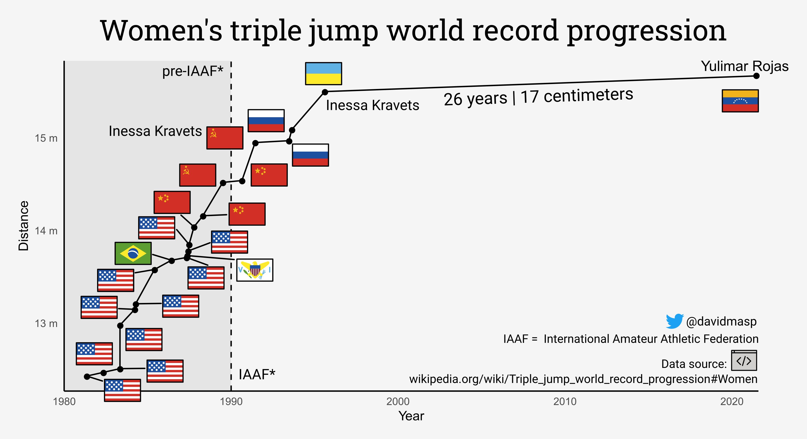

# README

## Comment for reddit

[OC] After 26 years, Yulimar Rojas breaks the world record in women's triple jump

The chart shows the Women's Triple Jump World record progression from 1980 to now. The
record was broken today in the Tokyo's Olympics after 26 years by Yulimar Rojas from Venezuela.
The record progression started to grow after the 80s and stopped
drastically after the 90s with Inessa Kravets from Ukraine.
Prior to 1980 there were also long periods of record stability but I am
unsure if this was due to less standardized ways of measuring records or less
competitiveness.

* Source: https://en.wikipedia.org/wiki/Triple_jump_world_record_progression#Women
* Tools Used: R and ggplot for the initial wrangling and plotting the data points, then Inkscape to add svg flags from openmoji
